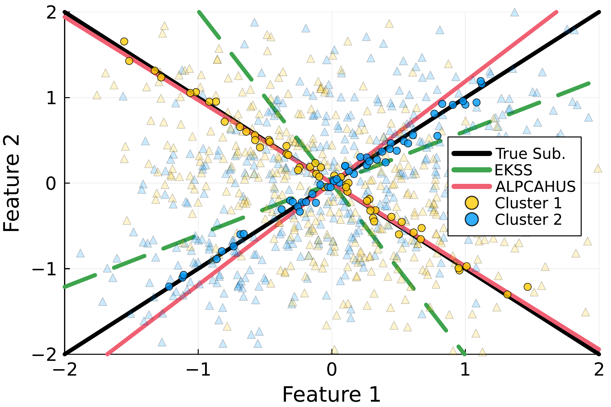

# ALPCAHUS: Subspace Clustering for Heteroscedastic Data

ALPCAHUS is a method for clustering low-rank data under heteroscedastic noisy conditions.



# Model 

## Single Subspace Model (K=1) $\implies$ ALPCAH

Let $y_i \in \mathbb{R}^{D}$ denote the data samples
for index $i \in \{1,\ldots,N \}$ given $N$ total samples,
and let $D$ denote the ambient dimension.
Let $x_i$ represent the low-dimensional data sample
generated by $x_i = U z_i$
where $U \in \mathbb{R}^{D \times d}$ is an unknown subspace basis of dimension $d$
and $z_i \in \mathbb{R}^{d}$ are the corresponding basis coordinates.
Collect the measurements into a matrix
$Y = [\hspace{1mm} y_1, \ldots, y_N \hspace{1mm} ]$.
Then the heteroscedastic model we consider is
```math
y_i = x_i + \epsilon_i
\quad \text{where} \quad
\epsilon_i \sim \mathcal{N}(0, \nu_i I)
```
assuming Gaussian noise with variance $\nu_i$,
where $I$ denotes the $D \times D$ identity matrix.
We consider both the case where each data point may have its own noise variance,
and cases where there are
$G$ groups of data having shared noise variance terms
$\{ \nu_1,\ldots,\nu_G \}$.

In ALPCAH [(see github repo)](https://github.com/javiersc1/ALPCAH), we propose an optimization problem that estimates the heterogeneous noise variances $\{\nu_i\}$ and the subspace basis $U$.

## Union of Subspace Model (K>1) $\implies$ ALPCAHUS
Let
$Y = [\hspace{1mm} y_1, \ldots, y_N \hspace{1mm}] \in \mathbb{R}^{D \times N}$ denote a matrix whose columns consist of all $N$ data points
$y_i \in \mathbb{R}^D$.
We generalize above
to model the data
with a union of subspaces model as follows
$$y_i  = x_i  + \epsilon_i$$
$$x_i  = U_{k_i} z_i
\text{ for some }
k_i \in \{1, \ldots, K \}$$
where
$U_k \in \mathbb{R}^{D \times d_k}$ is a subspace basis that
has subspace dimension $d_k$. Here $z_i \in \mathbb{R}^{d_k}$
denotes the basis coefficients associated with $x_i$,
and $\epsilon_i \in \mathbb{R}^D$ denotes noise for that point
drawn from $\epsilon_i \sim \mathcal{N}(0, \nu_i I)$.

If the subspace bases were known,
then one would like to find the associated subspace label
$c_i \in \{ 1, \ldots,K \}$ for each data sample
by solving the following optimization problem
$$
    c_i = \argmin_{k} \| y_i -  U_k U_k^{T} y_i \|_2^2,
    \quad \forall y_i \in Y.
$$
This label describes the subspace association of a data point $y_i$
that has the lowest residual between the original sample and its reconstructed value
given the subspace model.
In general,
the goal is to estimate all of the subspace bases
$\mathcal{U} = ( U_1, \ldots, U_K )$
and cluster assignments
$\mathcal{C} = (c_1, \ldots, c_N)$
that describe the subspace labels of all points.

# Objective Function

## Single Subspace Model (K=1) $\implies$ ALPCAH

Let $\Pi = \mathrm{diag}(\nu_1,\ldots,\nu_N) \in \mathbb{R}^{N \times N}$
be a diagonal matrix representing the (typically unknown) noise variances. 
We factorize $X \in \mathbb{R}^{D \times N} \approx L R'$
where $L \in \mathbb{R}^{D \times \hat{d}}$
and $R \in \mathbb{R}^{N \times \hat{d}}$
for some rank estimate $\hat{d}$. Using the factorized form,
we propose to estimate $X$
by solving for $L$ and $R$ in the following optimization problem:
```math
  \min_{L,R,\Pi} \ f(L,R,\Pi)
```
```math
f(L,R,\Pi) = \frac{1}{2} \| (Y - L R') \Pi^{-1/2} \|_F^2 + \frac{D}{2} \log |\Pi|
```
and extracting the subspace basis by doing $\hat{U} = \text{SVD}(L)$ since both matrices have the same range.

## Union of Subspace Model (K>1) $\implies$ ALPCAHUS

For notational simplicity,
let 
$Y_k \triangleq Y_{\mathcal{C}_k} \in \mathbb{R}^{D \times N_k}$
denote the submatrix of $Y$
having columns corresponding to data samples
that are estimated to belong in the $k$-th subspaces,
i.e., $Y_k =Y_{\mathcal{C}_k} = \text{matrix}( \{ y_i \, : \, c_i = k \})$.
We apply this notation similarly to other matrices
such as
$\Pi_k \triangleq \Pi_{\mathcal{C}_k}= \text{diag}(\{\nu_i \, :\, c_i = k \})$.
For the union of subspace measurement model described above
we generalize ALPCAH with the following optimization problem
```math
\argmin_{\mathcal{L}, \, \mathcal{R}, \, \Pi, \, \mathcal{C}}
\sum_{k=1}^K \frac{1}{2} \| (Y_k - L_k R^T_k ) \Pi^{-1/2}_{k} \|_F^2
+ \frac{D}{2} \log | \Pi_k |
```
where $\mathcal{C}, \Pi, \mathcal{L}, \mathcal{R}$
denote the sets of estimated clusters, noise variances,  and factorized matrices respectively for each cluster $k = 1, \ldots, K$.
Specifically
$\mathcal{L} = \{ L_1, \ldots, L_K \} \text{ and }
\mathcal{R} =\{ R_1, \ldots, R_K \}
$
Our algorithm for solving this problem is called
ALPCAHUS (**ALPCAH** for **U**nion of **S**ubspaces).
Similar to KSS,
we alternate between updating subspace bases given cluster estimates
and updating cluster estimates by projection given subspace bases estimates.
We solve this optimization problem via alternating minimization between basis estimation $\forall k \in \{1, \ldots,K\}$ solve
```math
\argmin_{L_k, \, R_k, \, \Pi_k}
\frac{1}{2} \| (Y_k - L_k R_k^T) \Pi_k^{-1/2} \|_F^2 
+ \frac{D}{2} \log|\Pi_k| \quad \text{s.t.} \quad \Pi_k \succeq \alpha I
```
and data sample reassignment $\forall i \in \{1, \ldots, N\}$ solve
```math
    c_i^{(t_2 +1)} = \argmin_{k} J_{i}(k) = \| y_{i} -  U_k U_k^{T} y_{i} \|_2^2 \quad \text{s.t.} \quad \\
    c_i^{(t_2 +1)} \gets c_i^{(t_2)} \text{ if } \exists \tilde{k} \in \mathcal{S}_{J_i} \neq c_i^{(t_2)} \text{ such that } \\
    J_{i}(c_i^{(t_2)}) = J_{i} (\tilde{k}) \text{ occurs}.
```

# Installation
This repo contains Julia code for ALPCAHUS tested on Julia 1.11. The dependencies for this code is quite small, our code works with basic {LinearAlgebra, Plots, Random, Distributions, Statistics} julia libraries..

You can run code by downloading this repo and including the files that contain code in your julia file / notebook. All code is contained in the two files below.
```julia
include("ALPCAH/alpcahus.jl")
include("ALPCAH/cluster.jl")
```

# Usage example

## ALPCAHUS
```julia
function ALPCAHUS(
    X::Matrix, 
    K::Int, 
    d::Vector; 
    T::Int=3, 
    B::Int=128, 
    q::Int=64,
    subspaceMethod::Symbol=:alpcah,
    fastCompute::Bool=false, 
    alpcahIter::Int=10,
    finalStep::Bool=true, 
    varfloor::Real=1e-9, 
    spectralStart::Bool=false,
    adaptiveRank::Bool=false, 
    quantileAmount::Real=0.9, 
    flipTrials::Int=100,
    flipSkip::Int=10, 
    adaptiveMethod::Symbol=:flippa, 
    fixedSeed::Bool=false)
    """
    Heteroscedastic subspace clustering using K-Subspaces method by applying ALPCAH in the subspace update step instead of PCA. Generalized to the ensemble method to measure similarity of clusterings in trials. Various extra things included such as spectral initialization for KSS, adaptive rank method, etc...

    Input:
    X is DxN data matrix where N is number of points and D is ambient dimension
    K is integer describing number of subspaces of the data e.g. K=2
    d is vector of length K that contains subspace dimensions e.g. [3;3]
    T is integer describing how many times to update subspace basis and clusters
        for each base clustering b in 1:B e.g. T=3 is very reasonable when B>>1
    B is integer for number of trials to do in the ensemble method, usually
        as many trials as time allows is best
    q is integer describing how many columns/rows to keep in affinity matrix
        constructed. Cross validation might be required but usually something
        greater than d and much less than D is sufficient

    Optional parameters:
    subspaceMethod could be :alpcah or :pca depending if KSS/EKSS is wanted
        over ALPCAHUS
    alpcahIter (integer) tells how many updates of L,R,Pi are done to get an
        estimate of the basis. Low number works well e.g. 5/10/20 no need to
        solve problem exactly at each KSS step
    finalStep (bool) true/false determines whether to take final clustering of
        spectral clustering of the affinity matrix to calculate subspace basis and
        reclassify the points one final time. Suggested to keep on all times.
    varfloor (real) prevents noise variances from going below this threshold
        during ALPCAH subspace calculation. Suggested to keep at default value
        unless one actually knows something about the quality of the data
    fastCompute (bool) determines whether to use compact SVD to determine subspace
        basis or to use partial svd methods (Krylov) for fast computation.
    spectralStart (bool) is used only when B=1 (essentially KSS meaning one trial)
        and uses TIPS to get initial clusters and performs KSS with ideally a
        large T since B=1. Highly suggested over random init for KSS.
    adaptiveRank (bool) is used when it's difficult to predict or know the
        subspace dimensions. If on, start overparameterized with a "high d" to
        start shrinking the dimension.
    adaptiveMethod (symbol) can be :flippa or :eigengap depending on what
        method one is interested in. SignFlipPA outperforms Eigengap heuristic
        experimentally so use this when possible.

    Output:
    C is vector of length N that has labels for each point
    """
    end
```